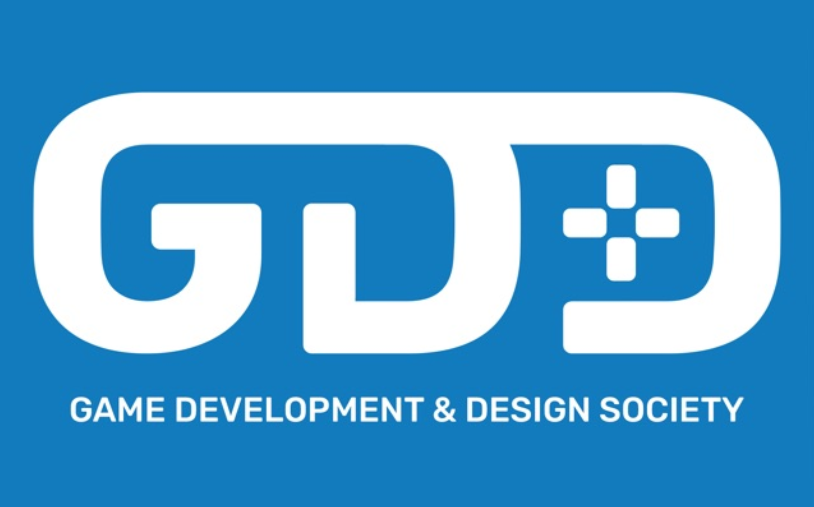

# UoB Game Development & Design Society — Workshops



[](https://example.com)
[](LICENSE)
[](https://godotengine.org/)

A central hub for **workshop materials** (slides, starter projects, finished code, and extra reading) for the **University of Bristol Game Development & Design Society**.

> 🔒 **Read-only for members:** Everyone can view & download. Only committee/maintainers can push. To suggest changes, open a Discussion or Issue.

---

## Quick links
- **Live Docs:** (enable GitHub Pages after first push)  
- **Workshop Downloads:** see the **Releases** tab for zipped packs
- **Discussions:** Q&A, suggestions, and ideas

## Structure
```
workshops/
  2025-01-intro-to-godot/
    slides/
    starter/
    solutions/
  2025-02-pixel-art-basics/
docs/                # MkDocs site (auto-published to Pages)
.github/workflows/   # CI for docs
```
Each workshop folder contains a README with instructions, plus **starter** and **solutions** projects. Keep large assets in Git LFS.

## Contributing
This repository is managed by the society committee. If you’d like to propose a fix or add-on:
1. Open a **Discussion** first.
2. If approved, submit a PR.

## Local docs preview
```bash
pip install mkdocs mkdocs-material
mkdocs serve  # then open http://127.0.0.1:8000
```

## License
MIT © 2025 UoB Game Dev & Design Society
